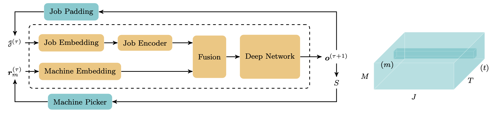
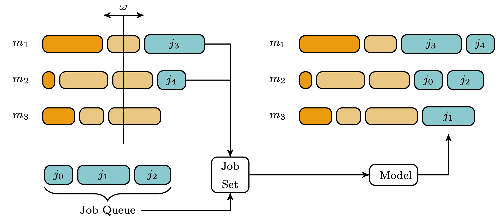

# Approaching Scheduling Problems via a Deep Hybrid Greedy Model and Supervised Learning

This is the official paper repository for our paper 'Approaching Scheduling Problems via a Deep Hybrid Greedy Model and Supervised Learning'.





## Requirements 

- Python 3.6
- Tensorflow 2.3
- Cplex Studio 12.10

## Installation

We suggest to create a virtual environment first via
```
python -m venv venv
```
and install the required packagees with
```
venv/bin/python -m pip install -r requirements.txt
```
The data generator requires the CPLEX Python API, which is part of IBM ILOG CPLEX Optimization Studio.
Find installation instructions [here](https://www.ibm.com/support/knowledgecenter/SSSA5P_12.8.0/ilog.odms.studio.help/Optimization_Studio/topics/COS_installing.html).

## Structure 

- *config.yaml* contains all the most important settings.
- *model_training.ipynb* is a jupyter notebook, which comprises the model training pipeline.
- *inference.ipynb* is a jupyter notebook, that can be used for analysing the model predictions.
- *data_generator.ipynb* is a jupyter notebook for data generating.
- *ckpts* contains checkpoints of the model stored during training.
- *data* contains the generated dataset.
- *log* contains tensorboard log files.
- *model* contains the neural network model.
- *plots* comprises some figures.
- *src* contains all the source code files used in the notebooks.
- *venv* is the virtual environment.

## Citation

Will be added soon.

## Troubleshooting
If `Can not execute command 'cpoptimizer -angel'. Please check availability of required executable file.` or `Executable file should be given in 'execfile' context attribute.`,
the link to the cpoptimizer `CPLEX_Studio_Community1210/cpoptimizer/bin/x86-64_linux/cpoptimizer` in
`venv/lib/python3.6/site-packages/docplex/cp/solver/solver_local.py`
is missing:
- Add the cpotimizer to the PATHs (recommended).
- Alternatively, add the link manually by replacing `xfile` and `context.execfile` with `cplex/CPLEX_Studio_Community1210/cpoptimizer/bin/x86-64_linux/cpoptimizer` in `class CpoSolverLocal(solver.CpoSolverAgent` (**HACKY**).
Don't forget to restart the kernel afterwards.
